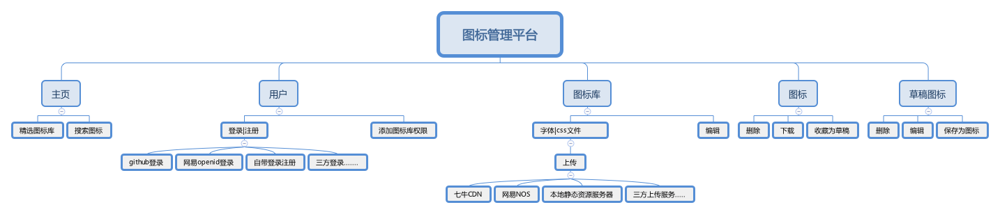

## Nicon

Nicon 是一个集图标上传、展示、使用于一身的字体图标管理平台，流程简单，符合日常开发使用习惯，适合企业在内部部署使用。采用 Iconfont 字体图标替换项目中图片图标的使用，以达到缩减体积、风格统一、提高开发效率等目的。若配合设计师使用，设计师可在平台上管理图标，复用图标，减少设计图标耗费的时间，而开发只负责使用设计师维护好的图标库，减少了与设计师的交流成本。

## 优势
与其他字体图标管理平台相比，它拥有以下优势：

* 使用流程简单，符合日常开发使用习惯，无需在审核管理流程中耗费时间
* 部署简单，支持可视化配置部署，平台自带注册、登录功能，还有静态资源路由，只需数据库配置就可部署使用
* 支持接入三方登录、资源上传到三方CDN服务器。使用更安全，资源更稳定
* 支持导出资源多样化，符合多种使用场合，更有配套的导出工具[nicon-tookit](https://github.com/bolin-L/nicon-toolkit), 方便快捷


## 结构设计图


## 使用流程图
**使用流程图**


**开发使用流程图**


**设计师参与使用流程图**


如果设计师与开发协同参与使用维护图标库，不仅使设计师可以有一个可视化管理字体图标的平台。还可以减少开发与设计的交流时间。


## 服务安装部署
**系统要求**

- linux/unix

**环境要求**

- pm2 2.9.0+
- nodejs 7.0+
- npm 3.10.8+
- mogondb 3.2+
- redis 3.2+

在启动工程之前，必须确保数据库已经启动，且已经把相应的数据库创建好。

1、 克隆项目到本地|服务器

```
git clone git@github.com:bolin-L/nicon.git
```

2、  进入到项目工程nicon安装依赖

```
cd nicon && npm install
```

3、运行启动命令

```
npm run publish
```

这时服务端基本启动完毕，数据库等其他信息的配置等配置前端静态资源之后再配置。服务默认监听的端口是4843, 当然这只是个纯服务，具体的页面还需要部署前端工程[nicon-front](https://github.com/bolin-L/nicon-front)。

## 前端静态资源部署
图标管理平台采用的是前后端完全分离的开发方式，前端代码放在独立的[icon-front](https://github.com/bolin-L/nicon-front)。前端只需要提供完整的静态html页面与其他静态资源即可。静态资源的访问通过配置nginx代理实现页面的访问，跟服务端工程毫无关系，服务端只负责提供异步接口。

1、克隆前端项目到本地, 与nicon文件夹同级

```
git clone git@github.com:bolin-L/nicon-front.git
```

2、进入到nicon-front工程，安装依赖

```
cd nicon-front && npm install 
```

3、运行打包命令、打包输出到nicon-front/dist文件夹下

```
npm run build
```

现在服务已经启动，静态资源已经输出，接下来需要配置nginx让请求可以访问到静态资源，异步接口可以访问到服务。

## Nginx配置
当前端静态资源与后端服务部署在同一台机器，并且使用本地管理图标库字体文件资源时的nginx配置如下


```
server {
    listen 80;
    listen [::]:80;

    server_name icon.bolin.site;

    access_log   /var/log/nginx/bolin_sites_icon.access.log main;
    error_log    /var/log/nginx/bolin_sites_icon.error.log;

    include common.conf;
    # 静态资源请求
    location / {
        root /home/username/app/nicon-front/dist;
        index index.html index.htm;
    }
    
    location ^~ /static {
        root /home/username/app/nicon-front/dist;
    }
	# 配置异步接口请求到服务器
    location /api {
		proxy_set_header   X-Real-IP $remote_addr;
        proxy_set_header   Host      $http_host;
        proxy_pass http://127.0.0.1:4843;
    }
	# 服务端的字体文件资源请求
    location ^~ /resource {
        root /home/username/app/nicon;
    }
}
```

配置到此，平台基本就可以运行起来使用了，浏览器访问`icon.bolin.site`就可以访问到首页

## 数据库信息配置与三方服务接入
该平台在未配置任何数据库信息时就可以启动，但是访问之后会被重定向到[安装页面](http://icon.bolin.site/#/install)进行数据库信息与三方服务脚本的配置。配置分三部分，根据自己的需求来决定具体要配置哪部分。

**启动数据配置**

启动数据配置基本是`mongoDB`与`redis`数据库信息，且是必须。当然如果接入第三方服务时需要额外的配置也可以通过此页面来配置，添加的所有变量都可以从`process.env`环境变量对象中拿到。 这些配置最终会输出到 `./bin/start.sh`的启动脚本中，如果出现配置错误，先停掉服务然后手动去修改此文件，再执行 `sh ./bin/start.sh`命令即可重启服务

比如我使用github登录与七牛上传服务最终配置如下

```
#!/bin/bash

# DB config

# mongodb
export MONGODB_NAME=iconRepo;
export MONGODB_HOST=127.0.0.1;
export MONGODB_PORT=27017;
export MONGODB_USERNAME='';
export MONGODB_PASSWORD='';


# redis
export REDIS_FAMILY=4;
export REDIS_HOST=127.0.0.1;
export REDIS_PORT=6379;
export REDIS_PASSWORD='';
export REDIS_DB=0;


# config your website host
export productHost='icon.bolin.site';


# if you want login by github and upload by qiniu, set productType
export productType='github_qiniu';


# Login config

# github openid login
export GITHUB_LOGIN_CLIENT_ID='';
export GITHUB_LOGIN_CLIENT_SECRET='';
export GITHUB_LOGIN_REDIRECT_URI='';


# Upload config

# qiniu
export QINIU_UPLOAD_ACCESS_KEY='';
export QINIU_UPLOAD_SECRET_KEY='';
export QINIU_UPLOAD_BUCKET='';
export QINIU_UPLOAD_CDN_HOST='';

# start command
npm run restart

```


虽然该平台已经可以提供完成的登录、注册，图标库样式文件等静态资源的访问。但是对于企业来说，内部的工具平台最好只接受内部人或只能内网访问，对于静态资源最理想的就是放到自家的cdn服务器上，让平台操作更安全，访问所速度更快等等...

基于这样的需求，Nicon支持接入三方登录与字体文件资源上传到三方服务器，但是具体的代码需要自己实现，代码要求暴露出指定的方法且该方法需返回指定的数据，然后通过配置的方式添加到工程中。具体调用什么服务由配置的`prodcutType`的值决定，`productType`的值格式为 `登录_上传`，目前默认服务类型有4种`default`、`default_qiniu`、`github_default`、`github_qiniu`，当`productType`的值为这4个时，三方服务脚本是不需要配置的。

三方服务配置脚本就在以下的文件夹结构中生成名称为`productType`值的文件夹，有`index.js`、`config.js`两个文件。 除了以下的文件夹，用户配置后生成的文件夹都会被ignore掉。

```
├── service
│   ├── login
│   │   ├── default
│   │   │   ├── config.js
│   │   │   └── index.js
│   │   ├── github
│   │   │   ├── config.js
│   │   │   └── index.js
│   │   ├── github_qiniu
│   │   │   ├── config.js
│   │   │   └── index.js
│   │   ├── index.js
│   └── upload
│       ├── default
│       │   ├── config.js
│       │   └── index.js
│       ├── github_qiniu
│       │   ├── config.js
│       │   └── index.js
│       ├── index.js
│       └── qiniu
│           ├── config.js
│           └── index.js

```

**三方登录**

比如我需要接入github三方登录与qiniu上传存储服务，那么我的`productType`就设置为`github_qiniu`。 那么就会自动在`service/login/` 文件夹下创建文件夹 `github_qiniu`, 然后在该文件夹下创建`config.js` , 与`index.js`, 在index.js文件中必须暴露出async `login`方法, 调用方法后需要返回指定格式的数据

```
// index.js

require('request');
let rp = require('request-promise');
let config = require('./config');

class GithubOpenIdLogin {
    async login (ctx) {
        return this.getUserBaseInfo(ctx);
    }

    async getUserBaseInfo (ctx) {
        // your code
        
        // login 方法返回的数据格式
		return {
		    userName: tokenInfo.sub, // 必须且唯一
		    password: tokenInfo.sub,
		    email: openIdUserInfo.email,
		    nickName: openIdUserInfo.nickname,
		    fullName: openIdUserInfo.fullname
		}
    }
}

let loginIns = new GithubOpenIdLogin();
module.exports = loginIns.login.bind(loginIns);

```
**三方上传**

在`service/upload/` 文件夹下自动创建文件夹 `github_qiniu`, 然后在该文件夹下创建`config.js` , 与`index.js`, 在index.js文件中暴露出async `upload`方法, 调用方法后需要返回指定格式的数据

```
// index.js

let config = require('./config');
let qiniu = require('qiniu');

class QiniuUpload {
    async upload (dirPath) {
        let fontMap = await this.uploadFonts(dirPath);
        // 上传font完毕后替换css中的引用
        let cssContent = await this.replaceFontsInCss(dirPath, fontMap);
        let cssUrl = await this.uploadCss(dirPath, cssContent);
        
        // 上传返回数据格式
        return {
            url: cssUrl, // 必须
            cssContent: cssContent // 必须
        };
    }
}

let uploadIns = new QiniuUpload();
module.exports = uploadIns.upload.bind(uploadIns);

```

至此就已经配置完毕，当保存提交之后工程就会重启，根据配置启动相应的服务。

## 单元测试
待补充....

## License
MIT


